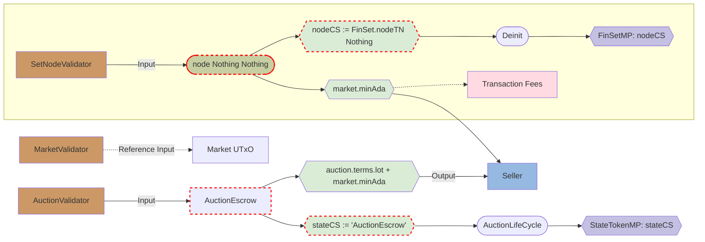

## Table of Contents

- [General](#general)
  - [Specification for Tx inputs](#specification-for-tx-inputs)
  - [Specification for Tx outputs](#specification-for-tx-outputs)
- [Special UTxO](#special-utxo)
  - [State Tokens](#state-tokens)
    - [`RegistrationEscrow`](#registrationescrow-utxo)
    - [`AuctionEscrow`](#auctionescrow-utxo)
    - [`BidEscrow`](#bidescrow-utxo)
  - [Market Token](#market-token)
    - [`Market`](#market-utxo)
- [Common DataTypes](#common-datatypes)
- [Minting Policies](#minting-policies)
  - [FinSetMintingPolicy](#finset-minting-policy)
  - [MarketTokenMintingPolicy](#market-token-minting-policy)
  - [StateTokenMintingPolicy](#state-token-minting-policy)
    - [`AnnounceAuction`](#announceauction)
    - [`AuctionLifeCycle`](#auctionlifecycle)
    - [`Registration`](#registration)
    - [`EnrollBidder`](#enrollbidder)
- [Validators](#validators)
  - [MarketValidator](#market-validator)
  - [PrivateAuctionValidator](#private-auction-validator)
    - [`UnregisterAct`](#unregisteract)
    - [`IssuePaddleAct`](#issuepaddleact)
  - [PublicAuctionValidator](#public-auction-validator)
    - [`BuyNowNoEnrollAct`](#buynownoenrollact)
  - [CommonAuctionRedeemers](#common-auction-redeemers)
    - [`CancelAct`](#cancelact)
    - [`BidAct`](#bidact)
    - [`ExtendAct`](#extendact)
    - [`CloseExtendAct`](#closeextendact)
    - [`BuyNowAct`](#buynowact)
    - [`RefundAct`](#refundact)
    - [`ResolveAuctionAct`](#resolveauctionact)
 - [Flow Diagram Key](#flow-diagram-key )

---    
# General

Tx inputs, outputs and minting are specified in a pattern-matching style, so the requirements are applied from top to bottom as patterns.

*Anywhere* matches any amount of any destinations (scripts or wallets).

*Anything* matches any amount of any UTxOs.

A Tx MUST mint exactly the values that is explicitly specified for it. No more, no less.

All measurements of time are given in milliseconds.

All `Natural` amounts are given in ADA.

---
## Specification for Tx inputs
**Specification for inputs from validators is always closed**

This means that if the input doesn't match any of the specified inputs from a validator, it must not be present in the Tx.

However allowing additional inputs from unspecified destinations must be allowed. This allows for built-in fees to be paid.

Validation of Tx inputs [may be](#input-utxo-contains-asset-of-auctions-statecs-or-nodecs-cant-be-malformed) weakened (for performance reasons) if those came from trusted source:
- StateTokenMP
- SetNodeMP
- AuctionValidator
- NodeValidator
If they contain asset with `StateToken` or `SetNode` CS.

## Specification for Tx outputs
Unlike specification for inputs, **specification for outputs are open**.
This means that any unspecified outputs are allowed.

---
## Special UTxO

A *Special UTxO* is a UTxO that holds certain specified properties.
The `Validator` must be capable of proving these UTxOs in it's inputs are indeed *Special UTxO*s (i.e. satisfies specified properties).

*Special UTxOs* serve multiple purposes: 
- `AuctionValidator`
  - AuctionEscrowUTxO: Holds the particular auctions lot as well as the terms in its datum. Identified by the `AuctionEscrow` State Token
  - BidEscrowUTxO: Holds the bidder's current bid in its datum as well as a value >= the bid. Identified by the `BidEscrow` State Token
  - RegistrationEscrowUTxO: Holds the registrants `Address` in its datum. Identified by the `RegistrationEscrow` State Token
- `MarketValidator`
  - MarketUTxO: Holds the Market terms. Identified by the 'MarketTerms' Market Token

General requirements:
- MUST contain required amount of `minAda` specified by the `MarketTerms`
- MUST contain no more assets than specified to prevent Token Dust attack

```haskell
data UTxO = MkUTxO
  { datum :: t -- The TxOut datum as t
  , extraValue :: Value -- The extraValue in the TxOut excluding the specific stateToken and the minAda 
  , stake :: Maybe StakingCredential -- We extract this out of the UTxO to ensure correctness
  }

validSpecUTxO ::
  SpecialUTxOTag t ->
  CurrencySymbol ->
  TxOut ->
  Maybe (UTxO t)
validSpecUTxO BidEscrow auctionCS txOut = do
  (adaAmount,Set [bidToken]) <- Value.splitByAda txOut.value
  guard $ bidToken == stateTokenValue auctionCS BidEscrow
  let extraValue = adaAmount - minAdaFor BidEscrow
  guard $ extraValue >= 0
  datum <- datumOf BidEscrow txOut.datum
  guard $ case datum of
    BidEscrow {status = Bid bid} ->
      lovelaceAmountOf extraValue >= bid
    _       -> True
  pure UTxO {datum, extraValue, stake = txOut.address.stakingCredential}
validSpecUTxO AuctionEscrow auctionCS txOut = do
  datum <- datumOf AuctionEscorw txOut.datum
  let lot = txOut.datum.terms.lot
      auctionToken = stateTokenValue auctionCS AuctionEscrow
      corrNodeToken = mkCorrNodeToken datum.nodeCS
  (adaAmount,tokens) <- Value.splitByAda txOut.value
  guard $ tokens == Set [lot,auctionToken,corrNodeToken]
  let extraAda = adaAmount - minAdaFor AuctionEscrow
  guard $ extraAda >= 0
  pure UTxO
    { datum
    , extraValue = extraAda <> lot
    , stake = txOut.address.stakingCredential
    }
  where
    lot = txOut.datum.terms.lot
validSpecUTxO RegistrationEscrow auctionCS txOut =
  (adaAmount,Set [regToken]) <- Value.splitByAda txOut.value
  guard $ regToken == stateTokenValue auctionCS RegistrationEscrow
  let extraValue = adaAmount - minAdaFor RegistrationEscrow
  guard $ extraValue >= 0
  datum <- datumOf RegistrationEscrow txOut.datum
  pure UTxO {datum, extraValue, stake = txOut.address.stakingCredential}

Value.splitByAda :: Value -> Maybe (Natural,Set SingletonValue)

stateTokenValue :: CurrencySymbol -> (t : Type) -> SingletonValue
stateTokenValue stateCS tag = (stateCS,nameToken,1)
  where
    nameToken :: TokenName
    nameToken = case tag of 
      AuctionEscrow -> "AuctionEscrow"
      BidEscrow -> "BidEscrow"
      RegistrationEscrow -> "RegistrationEscrow"

hasDatum :: TxOut -> (t : AuctionEscrow ∪ BidEscrow ∪ RegistrationEscrow) -> Bool
hasDatum txOut tag = isJust $ datumOf tag txOut

minAdaFor :: Natural -> (t : Type) -> Bool
minAdaFor tag = case tag of 
    AuctionEscrow -> 2 * minValue
    BidEscrow -> minValue
    RegistrationEscrow -> minValue * 2
    _ _ _ = False
  where
    minValue = adaValue minADA
```

This way, a `BidEscrow` UTxO with given `bidDatum` datum, escrow `bidDeposit`, `minAda` and `stateToken` can be represented as:
```haskell

bidEscrow = MkUTxO
  { datum = bidDatum :: BidEscrow
  , extraValue = bidDeposit :: { v : Value | v ⊆ adaValue bid.datum.status.Bid }
  }
```

---
## State Tokens

Are used in *Special UTxO*s that have strong lifecycle restrictions.

Every *State Token* of a particular auction must correspond to one *Set Node Token* of the same auction. In other words, there must be 1:1 correspondence between an auction's *State Token*s and *Set Node Token*s.

There are several restrictions that helps to enforce this property:
- Every *State Token* `t` is always locked at the Auction Validator
- The amount of *State Token*s minted in a Tx must always be the same as the amount of *Set Node Token*s minted in the same Tx.
- Likewise the amount of *State Token*s burnt in a Tx must always be the same as the amount of *Set Node Token*s burnt in the same Tx.

---
### RegistrationEscrow UTxO 
#### *Only used in Private Auctions*

The UTxO sent to the Auction Validator that contains the prospective bidder's minimum deposit for participation in the auction. It can be consumed by the Seller before the auction starts to issue a Paddle to the bidder.


Holds Value: 
```haskell
ada <> registrationToken; ada ⊇ market.minAda * 2
```

Carries datum:
```haskell
data RegistrationEscrow = 
   MkRegistrationEscrow
      { registrant :: Address }
```

---
### AuctionEscrow UTxO
The UTxO that witnesses that particular auction exists and holds the lot.
At any moment of time there is only one such UTxO for a particular auction.

Holds Value: 
```haskell
market.minAda * 2 <> auctionToken <> otherNodeToken
where
 extra = if utxo.datum.terms.bought then mempty else utxo.datum.terms.lot
```

Carries datum:
```haskell
data AuctionEscrow = MkAuctionEscrow
     { terms :: AuctionTerms 
     , nodeCS :: CurrencySymbol }
```

---
### BidEscrow UTxO
The UTxO for a particular bidder in an auction.

Holds Value:
```haskell
adaEscrow <> market.minAda <> bidToken
where
  adaEscrow >= ada (bidSize datum.status) + ada fees
  fees = feesFromBidder market auction datum
```

Carries datum:
```haskell
data BidEscrow = MkBidEscrow
     { status :: BidStatus
     , bidder :: Address
     }
```

where
```haskell
data BidStatus
  = NoBid
  | Bid 
    { amount :: Natural
    , bidTime :: POSIXTime {- Used to settle bids of equal value. The current bid cannot have been submitted after its bidTime. And the bidTime cannot be after the close -}
    }
```

---
## Market Token
### Market UTxO
The UTxO that holds the Market Terms for all auctions. Held at the Market Validator.

Holds Value:
```haskell
ada <> marketToken
```

Carries datum:
```haskell
data Market = Market
  { terms :: MarketTerms }
```
---
## Dependency Graph of Grabbit protocal


---
# General Properties

These properties are assumed to be true and should be enforced by the rest of the spec and by implementation.

---
### 2:1 correspondence between AuctionEscrow Token and OriginNode Token 
This property enforced by  
  - `StateTokenMP` 
  - FinSet and Auction Escrow must be initialised in the same Tx

### 1:1 correspondence between BidEscrow Tokens and Node Tokens
This property enforced by  
  - `StateTokenMP` 
  - `FinSetMP` always ensures that something with `csOf` `StateTokenMP` is minted/burnt.

### StateTokenMP is parameterised by the FinSetMP
This property helps ensure 1-1 correspondence & allows for easy location of corresponding scripts & outputs by combating utxo bloat.

### FinSetM` has access to StateTokenMP through the AuctionEcrow UTxO at the auctionValidator
This property is the result of the `AuctionEscrow` containing a `SetNode` token which means that the `FinSetMP` can always locate it as a input/reference input and extract the `StateTokenMP`'s currency symbol from it.

### FinSet and AuctionEscrow initialized in the same Tx.
This property is the result of the fact, that (for a single auction) the initial step for both the `FinSetMP` and `StateTokenMP` must destroy the same `TxOutRef`.
If they destroy different `TxOutRef`s, they are not related to the same auction.
If only one of the MP destroys  the `TxOutRef` and initializes, then that `TxOutRef` no longer exists and therfeore the second could never initialize.

### Input UTxO contains asset of Auction's StateCS or NodeCS can't be malformed

This kind of properties holds for Special UTxO with CS of MP that follows #1:
1. MP doesn't allow:
  - output of a minted value in a malformed Special UTxO
  - output of a minted value in any validator that doesn't follow property #2
2. Validator on which such Special UTxOs are locked doesn't allow:
  - output of it's value in a malformed Special UTxO
  - output of it's value to an address that doesn't follow this property.

SetNodeMP and StateTokenMP MUST hold #1
AuctionValidator and NodeValidator MUST hold #2

---
## Common datatypes

```haskell
-- The Auction Terms specific to each Auction
data AuctionTerms = MkAuctionTerms
  { lot :: Value -- Must contain no more than 50 assets
  , auctionInfo :: AuctionInfo
  , bidInfo :: BidInfo
  , time :: AuctionTime
  , -- If true the lot has been bought and all bids can be refunded
    bought :: Bool
  }

data AuctionTime = MkAuctionTime 
  { start :: POSIXTime
  -- ^ The time BEFORE which auction is not yet open and AFTER which auction is open
  , close :: POSIXTime
  -- ^ The time BEFORE which auction is not yet closed, and AFTER which auction is open
  , extension :: TimeExtension
   -- ^ The time before the close after which the auction can be extended
  } 
      
data AuctionInfo = MkAuctionInfo
  { seller :: Address
  , {- a Map of the Beneficiaries and the percentage they will receive. The percentage must
       come to 100 and is enforced in validation when announcing an auction -}
    beneficiaries :: Map Address Natural
  , -- If true the Seller/Beneficiaries must cover the auction fees 
    sellerToCover :: Bool
  , -- The bid to automatically win the lot and cancel the auction
  }

data TimeExtension = MkTimeExtension
  { window :: Natural
  -- ^ A period of time (in ms) BEFORE auction.time.close in
  -- which it's possible to extend the auction.
  -- Note it should be at least twice the extension window
  , length :: Natural
  -- ^ A period of time (in ms) FROM auction.time.close on
  --    which auction can be extended.
  }
  
data BidInfo = MkBidInfo
  { buyNowPrice :: Natural
    -- The price to instantly buy lot, in ADA.
    -- Must be at least `minimumBid`.
  , startingPrice :: Natural
    -- The minimum bid in ADA.
    -- Must be enough to cover `market.minAda` for all beneficiaries plus `market.fixedFee`.
  , bidIncrement :: BidIncrement
  , raiseMinimum :: Natural -- The minimum bid raise, in ADA.
  , raisePercentage :: Natural
    -- The least percentage of the total current bid that the bid can be raised.
  , gateCurrency :: Maybe CurrencySymbol
  -- The currency symbol of wich an asset is required to be included if the auction is gated.
 }

-- The Market Terms generalized to all Auctions
data MarketTerms = MkMarketTerms
  { fixedFee :: Natural 
  -- ^ Flat fixed fee for all auctions, in ADA.
  , percentageFee :: Natural
  -- ^ Fee percentage of the winning bid.
  , address :: Address
  -- ^ The Address the fees are to be paid to.
  , minAda :: Natural
  -- ^ The current minimum Ada requirement, in ADA
  } 
```

---
# Minting Policies

## FinSet Minting Policy
Described in the 
[Finite Set spec](./spec-1.0-finite-set.md##minting-policies-for-node-operations).

---
## Market Token Minting Policy 
Mints the Market Token which is used to identify the Market UTxO which holds the market terms.

```hs
mkMarketMP :: 
  TxOutRef {- The TxOutRef to consume -} ->
  Data ->
  ScriptContext ->
  ()
mkMarketMP = \oRef _ ctx -> ...
```
This is a standard one shot minting policy ensuring the Market Token is unique and easily identifiable by all other validators and minting policies.

---
## State Token Minting Policy
```hs
mkStateMP ::
  ValidatorHash {- The auction Validator Hash. (to be applied prior to script compilation) -} -> 
  CurrencySymbol {- The CS of the Market Token. (to be applied prior to script compilation) -} -> 
  AuctionTerms {- The auction Terms -} ->
  CurrencySymbol {- The complimentary Set Node minting policy -} ->
  TxOutRef {- The TxOutRef to consume -} ->
  StateMintingRedeemer ->
  ScriptContext ->
  ()
mkStateMP = \auctionValidator mCS terms nodeCS oRef redm ctx -> ...

data PrivateStateMintingRedeemer 
  = AnnounceAuction 
  | Registration
  | AuctionLifeCycle

data PublicStateMintingRedeemer 
  = AnnounceAuction 
  | EnrollBidder
  | AuctionLifeCycle
   
```
---
### AnnounceAuction


Purpose: creates the auction and issues the `AuctionEscrow` once per auction by witness destroying specific UTxO.

*Note: this Tx won't be validated by `auctionValidator`, therefore checks must be comprehensive.*

Mint:
- `ownCS`
  - `1` of `tokenName AuctionEscrow`
- `nodeCS`
  - 1 of `FinSet.corrNodeTN Nothing`
  - 1 of `FinSet.setNodeTN Nothing`

Validation rules:
- terms.startingPrice >= length terms.beneficiaries * market.minAda + market.fixedFee   
- sum auction.terms.beneficiaries = 100 *The sum of the percentage to beneficiaries must equal 100*
- `length (flattenValue terms.lot) ≤ 50` *the current assets limit for lot to prevent Token Dust attack*

Reference Inputs:
- From anywhere: 
  - `Market UTxO` as *market*

Inputs:
- From `auction.terms.seller`:
  - - auction.terms.lot
    - market.minAda * 2
- From anywhere:
  - Anything

Outputs:
- To `auctionValidator`:
  - `AuctionEscrow UTxO` as *auction*

*FinSetMP will ensure that the node is sent to the Node Validator*

---
### AuctionLifeCycle
Purpose: Mint/Burn StateTokens.

*Note: This has weak constraints, due to the fact that all LifeCycle transactions MUST be validated by the `auctionValidator`.*

Inputs:
- From `AuctionValidator`:
  - At least one UTxO *(forces validation against `auctionValidator`)*
- From anywhere:
  - Anything

---
### Registration 
#### *Private Auction*
as `redeemer`
Purpose: Mints a registration token to easily identify a registration UTxO

Mint:
- `ownCS`
  - `1` of `tokenName RegistrationEscrow`
- Anything

Reference Inputs:
- From anywhere: 
  - `Market UTxO` as *market*

Outputs:
- To `auctionValidator`:
  - `RegistrationEscrow UTxO` as *registration* 
  
  *NB: register with original Stake Key address*

---
### EnrollBidder 
#### *Public Auction*
*Due to reference inputs we do not have any inputs from Auction Validator and therefore all logic must be contained within 
the minting policy*

Purpose: Enroll bidder, creates blank bid with option to make starting bid if auction already started.


Validation rules:
- Tx validity interval ⊂ (-∞;`terms.closingTime`]
- Signed by `bidder`
- `bid.datum.bidder` = `bidder`
- ```hs
  case bid.datum.status of
    NoBid -> Always
    Bid {amount,bidTime} -> 
      amount >= auction.terms.startingPrice
        && auctionStarted
        && Tx validity interval ⊂ (terms.startingTime;terms.closingTime] -- Can raise bid only on active auction
        && act.bidTime `after` TxValidityInterval -- Time of bid must be after the Tx has been submitted so as not to falsely claim an earlier bidTime
  ```
- Includes an asset of `auction.terms.gateCurrency` if required

*NB: Don't forget to check BidEscrow UTxO own properties*

Mint:
- `stateCS`
  - `1` of `tokenName BidEscrow`
- `nodeCS`
  - `1` of `FinSet.nodeTN (Just bid.datum.bidder)` 
    - *This is necessary to enforce SetNodeMP to validate Tx correctly.*

Reference Inputs:
- From anywhere: 
  - `Market UTxO` as *market*
- From `auctionValidator`:
  - `AuctionEscrow UTxO` as *auction*

Inputs:
- From `bid.bidder`
  - enrollment
   
- From Anywhere:
  - Anything

Outputs:
- To `auctionValidator`:
  - `BidEscrow UTxO` as *bid* NB: with original Stake Key address
  - Anything
- To anywhere:
  - Anything

```haskell
auctionStarted :: Bool
auctionStarted = Tx validity interval ⊂ [terms.startingTime; +∞)
```
---
# Validators

## Market Validator

Responsible for ensuring the market Terms are correct and up to date.

```haskell
marketValidator :: CurrencySymbol -- The MarketToken MintingPolicy 
                   -> Term s (PData :--> PData :--> PScriptContext :--> PUnit)
marketValidator = plam $ \_ _ ctx -> ...
``` 

Purpose: To hold the Market Terms.
*Note: once a market has been created it cannot be changed or removed. If you want different terms, you must create a new market.*

Validation rules:
- `Never`
---
## Private Auction Validator

```haskell
mkPrivateAuctionValidator ::
  CurrencySymbol -> -- The CS of the Market Token. (to be applied prior to script compilation)
  Term
    s
    ( Data
        :--> PPrivAuctionRedeemer
        :--> PScriptContext
        :--> PUnit
    )
mkPrivateAuctionValidator marketCS = plam $ \_ redeemer ctx' ->
```

Redeemer:
```haskell
data PrivAuctionRedeemer
  = CancelAct {cs : CurrencySymbol, reason : CancelReason}
  | UnregisterAct {cs : CurrencySymbol}
  | IssuePaddleAct {cs : CurrencySymbol}
  | BidAct {cs : CurrencySymbol, bid : Natural, bidTime : POSIXTime}
  | ExtendAct {cs : CurrencySymbol}
  | BuyNowAct {cs : CurrencySymbol}
  | RefundAct {cs : CurrencySymbol, reason : RefundResaon}
  | ResolveAct {cs : CurrencySymbol}

data CancelReason
  = Failed 
  | Bought -- someone has used the BuyNow feature to close auction prematurely
  
data RefundReason
  = LostBid { winner :: Address }  
  | AbsentBid -- refund NoBid
  | BoughtLot -- someone has used the BuyNow feature to close auction prematurely

```

---
### UnregisterAct
as `act`

Purpose: cancel bidder registration request and gives back their registration escrow.

Validation rules:
- Tx validity interval ⊂ (`registration.datum.deadline`;+∞)
- Signed by `registration.datum.from`

Mint:
- `stateCS`
  - `-1` of `tokenName RegistrationEscrow`

Reference Inputs:
- From anywhere: 
  - `Market UTxO` as *market*

Inputs:
- From `ownHash`:
  - `RegistrationEscrow UTxO` as *registration*
- From anywhere:
  - Anything

Outputs:
- To `registration.datum.from`: NB: with original Stake Key address
  - `registration.extraValue + market.minADA * 2`

---
### IssuePaddleAct
Purpose: issues paddle for registered bidder, creates blank bid.


Validation rules:
- Tx validity interval ⊂ (-∞;`auction.terms.close`]
- Signed by `terms.seller`
- `bid.datum = bidDatum`
- `bid.extraValue = registration.extraValue`

Mint:
- `stateCS`:
  - `-1` of `tokenName RegistrationEscrow`
  - `1` of `tokenName BidEscrow`
- `auction.nodeCS`
  - `1` of `FinSet.otherTN (Just act.bidder)`

Reference Inputs:
- From anywhere: 
  - `Market UTxO` as *market*
- From `ownHash`:
  - `AuctionEscrow UTxO` as *auction*
  
Inputs:
  - `RegistrationEscrow UTxO` as *registration*
  
- From anywhere:
  - Anything

Outputs:
- To `ownHash`:
  - *auction*
  - `BidEscrow UTxO` as *bid* NB: with original Stake Key address
  - Anything
  - 
- To anywhere:
  - Anything

```haskell
bidder :: Address
bidder := registration.datum.from

bidDatum := MkBidEscrow
  { status := NoBid
  , bidder := bidder
  }
```
---
## Public Auction Validator

```haskell
mkPublicAuctionValidator ::
  CurrencySymbol -> -- The CS of the Market Token. (to be applied prior to script compilation)
  Term
    s
    ( Data
        :--> PPrivAuctionRedeemer
        :--> PScriptContext
        :--> PUnit
    )
mkPublicAuctionValidator marketCS = plam $ \_ redeemer ctx' ->
```

Redeemer:
```haskell
data PubAuctionRedeemer
  = CancelAct {cs : CurrencySymbol} 
  | BidAct {cs : CurrencySymbol, bid : Natural, bidTime : POSIXTime}
  | ExtendAct {cs : CurrencySymbol}
  | CloseExtendAct {cs : CurrencySymbol}
  | BuyNowAct {cs : CurrencySymbol}
  | RefundAct {cs : CurrencySymbol, reason : RefundResaon}
  | ResolveAct {cs : CurrencySymbol}
  | BuyNowNoEnrollAct {cs : CurrencySymbol}
```

### BuyNowNoEnrollAct
as `act`

Purpose: Automatically wins the lot and posts a cancellation notice. Does not require an existing bid.


Validation rules:
- `act.bid >= auction.terms.buyNowPrice && bid.extraValue + buyNowValue >= act.bid + fees`
- signed by bidder
- Asset of `gateCurrency` CS included, if required

Reference Inputs:
- From anywhere: 
  - `Market UTxO` as *market*

Inputs:
- From `ownHash`:
  - `AuctionEscrow UTxO` as *auction*
  - Asset of `gateCurrency` CS, if required
- From `bidder`:
  - adaValue as *bidValue*

Outputs:
- To `bid.datum.bidder`: NB: with original Stake Key address
  - `auction.terms.lot`
- To `ownHash`:` 
  - `AuctionEscrow UTxO - auction.terms.lot` && `{ auction.terms.bought := True }`
- For each `(beneficiary,percentage)` in `auction.terms.beneficiaries`:
  - To `beneficiary`: 
    - `percentage * toBeneficiaries`
- To `market.address`:
  - `fees`

where
```hs
bidderFees := feesFromBidder market.datum auction.datum act.bid
sellerFees := feesFromSeller market.datum auction.datum act.bid

bidValue := lovelaceValue auction.terms.buyNowPrice - feesFromBidder
toBeneficiaries := lovelaceValue auction.terms.buyNowPrice + 2* market.minADA - feesFromSeller
```

---
## Common Auction Redeemers
Common auction lifecycle can be roughly represented as a graph:

### CancelAct 
#### *Only possible with no BidEscrows present or buyNowAct has occured. 
as `act`

Purpose: canceling the auction.
```haskell
case act.reason of:
  Failed:
```
Validation rules:
- Signed by seller
Mint:
  - `stateCS`:
    - -1 of `tokenName AuctionEscrow 
  - `auction.nodeCS`
    - -1 of `FinSet.nodeTN Nothing`
    - -1 of `FinSet.corrNodeTN Nothing`
Outputs:
- To `terms.seller`:
  - `terms.lot`
  - `lovelace market.minADA * 2`
```haskell
  Bought: 
```
Mint:
- `stateCS`:
  - -1 of `tokenName AuctionEscrow 
  - -1 of `boughtTN` 
- `auction.nodeCS`
  - -1 of `FinSet.nodeTN Nothing`
  - -1 of `FinSet.corrNodeTN Nothin`
Outputs:
- To `terms.seller`:
  - `lovelace market.minADA * 2`

Reference Inputs:
- From anywhere: 
  - `Market UTxO` as *market*

Inputs:
- From `ownHash`:
  - `AuctionEscrow UTxO` as *auction*

   *Note: AuctionEscrow UTxO must contain the lot (unless it was bought), otherwise RetrievePayment act could be avoided by seller and buyer cooperation*
- From anywhere:
  - Anything

---
### BidAct
as `act`

Purpose: a bidder makes their first bid, or raises existing.

Validation rules:
- Tx validity interval ⊂ (`terms.startingTime`;`terms.closingTime`] *Can raise bid only on active auction*
- ```act.bidTime `after` Tx validity interval``` *Bid can't happen before it's Tx submitted*
- Signed by `bid.datum.bidder`
- `bid.datum.bidder` = `bid'.datum.bidder`
- `validBidRaise`

*NB: Don't forget to check BidEscrow UTxO own properties*

Reference Inputs:
- From anywhere: 
  - `Market UTxO` as *market*
- From `ownHash`:
  - `AuctionEscrow UTxO` as *auction*

Mint: 
- Nothing

Inputs:
- From `ownHash`:
  - `BidEscrow UTxO` as *bid*
- From anywhere:
  - Anything

Outputs:
- To `ownHash`:
  - BidEscrow UTxO `{datum.bid := Bid {amount = act.amount, bidTime := act.bidTime}` as *bid'*

```haskell

escrowSize :: Natural
escrowSize := lovelaceAmountOf bid'.extraValue

validBidRaise :: Bool
validBidRaise :=
  case bid.datum.status of
    NoBid -> Always
    Bid currentBid
      | Just byPercentage <- 
          raisePercentage act.amount (unNatural currentBid)
      , act.amount - currentBid >= auction.terms.bidIncrement.absolute
      , byPercentage >= auction.terms.bidIncrement.percentage ->
          Never
    _ -> Never
  where
    raisePercentage :: ∀n. Fractional n => n -> n -> Maybe Natural
    raisePercentage := λ new current.
      toNatural $ truncate $ (new / current) * 100
```
---
### ExtendAct
as `act`

*Note any bids made in the same block after the bid extension will be invalidated and must be remade after.
However we can automate this process off-chain so that all bids made in the extension block are only submitted in the following block*

Purpose: An auction may be extended by anyone provided that they are able to prove that there is a bid that has been made within the `bidExtensionWindow`.

Validation rules:
- Tx validity interval ⊂ `bidExtensionInterval`
- `Bid {bidTime} = bid.datum.status` *NB: Empty bid cannot extend auction*
- `bidTime` ⊂ `bidExtensionInterval`

Reference Inputs:
- From anywhere: 
  - `Market UTxO` as *market*
- From `ownHash`: 
  - `BidEscrow UTxO` of `act.cs` as *bid*

Inputs:
- From `ownHash`:
  - `AuctionEscrow UTxO` of `act.cs` as *auction*
- From anywhere:
  - Anything

Outputs:
- To `ownHash`:
  - `auction { datum.terms.close := extendedClosingTime }`
  
where
```hs
bidExtensionInterval = (`auction.terms.close - auction.terms.bidInfo.bidExtensionWindow`;`auction.terms.close`]
extendedClosingTime = auction.terms.close + auction.terms.bidInfo.bidExtensionTime
```
---
### CloseExtendAct
as `act`

Purpose: The seller can terminate extensions for their auction. 

Validation rules:
- `(isJust auctionInputUTxO.datum.terms.time.extension)`
- `(isNothing auctionOutputUTxO.datum.terms.time.extension)`
- AuctionEscrow UTxO remains unmodified except for auction.time.extension
- Signed by `terms.seller`

Inputs:
- From `ownHash`:
  - `AuctionEscrow UTxO` of `act.cs` as *auction*
- From anywhere:
  - Anything

Outputs:
- To `ownHash`:
  - `auction { datum.terms.time.extension := Nothing }`

---
### BuyNowAct
as `act`
Purpose: Automatically wins the lot and posts a cancellation notice.


Validation rules:
- `act.bid >= auction.terms.buyNowPrice && bid.extraValue + buyNowValue >= act.bid + fees`
- signed by bidder

Mint:
- `stateCS`:
  - `-1` of `tokenName BidEscrow
- `auction.nodeCS`
  - `-1` of `FinSet.nodeTN (Just bid.datum.bidder)` 

Reference Inputs:
- From anywhere: 
  - `Market UTxO` as *market*

Inputs:
- From `ownHash`:
  - `AuctionEscrow UTxO` as *auction*
  - `BidEscrow UTxO` as *bid*
- From `bidder`:
  - adaValue as *additionalValue*

Outputs:
- To `bid.datum.bidder`: NB: with original Stake Key address
  - `market.minAda`
  - `auction.terms.lot`
- To `ownHash`:` 
  - `AuctionEscrow UTxO - auction.terms.lot && `{ auction.terms.bought := True }`
- For each `(beneficiary,percentage)` in `auction.terms.beneficiaries`:
  - To `beneficiary`: 
    - `percentage * toBeneficiaries`
- To `market.address`:
  - `fees`

where
```hs
bidderFees := feesFromBidder market.datum auction.datum act.bid
sellerFees := feesFromSeller market.datum auction.datum act.bid

additionalValue := lovelaceValue auction.terms.buyNowPrice - bid.extraValue + feesFromBidder
toBeneficiaries := lovelaceValue auction.terms.buyNowPrice + 2 * market.minADA - feesFromSeller
```
  
---
### RefundAct
as `act`


Purpose: refunds and removes the losing bid. A single step in the bid fold.
Can only happen _after auction completion_, or if _signed by the losing bid_ or if `auction.terms.bought`.

```haskell
case act.reason of:
  BoughtLot
```
- Validation rules:  
  - act.lostBid = lostBid.bidder  
  - auction.terms.bought == True  

```haskell     
  AbsentBid
```  
- Validation rules:  
  - lostBid = MkBidEscrow {status := NoBid, bidder := act.lostBid}. 
  - Tx validity interval ⊂ (auction.terms.auctionDeadline,+∞) || signed by lostBid.bidder. 

```haskell   
  LostBid winner
```
- Validation Rules:  
  - act.lostBid = lostBid.bidder  
  - localWinner.datum `higherBidThan` lostBid.datum  
  - localWinner.bidder == winner  
  - Tx validity interval ⊂ (terms.auctionDeadline,+∞) || signed by lostBid.bidder  
    
- Extra Reference Inputs:  
  - BidEscrow UTxo as *localWinner*  

Mint:
- `stateCS`:
  - `-1` of `tokenName BidEscrow
- `auction.nodeCS`
  - `-1` of `FinSet.nodeTN (Just lostBid.datum.bidder)` 
 
Reference Inputs:
- From anywhere: 
  - `Market UTxO` as *market*
- From `ownHash`:
  - `AuctionEscrow UTxO` as *auction*

Inputs:
- From `ownHash`:
  - `BidEscrow UTxO` as *lostBid*
- From anywhere:
  - Anything

Outputs:
- To `lostBidDatum.bidder`: NB: with original Stake Key address
  - `lostBid.extraValue + market.minADA` -- The SetNode minAda is used in transaction fees

where 
```hs
 -- simply `deriving stock Ord BidStatus`
 compare :: BidStatus -> BidStatus -> Ordering
 compare NoBid NoBid = EQ
 compare NoBid (Bid {}) = LT
 compare (Bid {}) NoBid = GT
 compare (Bid {amount = x}) (Bid {amount = y}) = x < y

 higherBidThan :: BidEscrowDatum -> BidEscrowDatum -> Bool
 higherBidThan := λ datum datum'.
    (datum.status  × datum.bidTime  × datum.bidder) >
    (datum'.status × datum'.bidTime × datum'.bidder)
```

---
### ResolveAuctionAct

Purpose: finalizes the auction and distributes the funds between winner and beneficiaries.

Validation rules:
- Tx validity interval ⊂ (`auction.terms.close`;+∞) 
- `bid.datum.status = Bid bidPrice`
- `auction.terms.bought = False`

Mint:
- `stateCS`:
  - `-1` of `tokenName AuctionEscrow`
  - `-1` of `tokenName BidEscrow`
- `auction.nodeCS`
  - `-1` of `FinSet.nodeTN Nothing`
  - `-1` of `FinSet.nodeTN (Just bid.datum.bidder)` 

Reference Inputs:
- From anywhere: 
  - `Market UTxO` as *market*

Inputs:
- From `ownHash`:
  - `AuctionEscrow UTxO` as *auction*
  - `BidEscrow UTxO` as *bid*
- From anywhere:
  - Anything

Outputs:
- To `bid.datum.bidder`: NB: with original Stake Key address
  - `bid.extraValue - lovelaceValue bidPrice + market.minAda - bidderFees`
  - `auction.extraValue`
- For each `(beneficiary,percentage)` in `auction.terms.beneficiaries`:
  - To `beneficiary`: 
    - `percentage * toBeneficiaries`
- To `market.address`:
  - `fees`

where
```hs
bidderFees := feesFromBidder market.datum auction.datum bid.datum
toBeneficiaries := lovelaceValue bidPrice + market.minADA - feesFromSeller market.datum auction.datum

fees := market `feesFor` bidPrice
```
### Common functions
```hs
feesFromSeller :: MarketTerms -> AuctionTerms -> Integer -> Integer
feesFromSeller marketTerms auctionTerms bidSize =
  | terms.fees.sellerToCover = market `feesFor` bidSize
  | otherwise = 0

feesFromBidder :: MarketTerms -> AuctionTerms -> BidEscrow -> Integer
feesFromBidder marketTerms auctionTerms bidDatum =
  case datum.status of
    Bid {bid} | terms.fees.sellerToCover -> market `feesFor` bid
    NoBid -> 0

bidSize :: BidStatus -> Natural
bidSize (Bid bid) = bid
bidSize NoBid = 0

feesFor :: MarketTerms -> Integer -> Integer
feesFor market for = market.fixedFee + (market.percentageFee / 100) * for
```
---
### Flow Diagram Key 
```mermaid
graph TB
    Validator[Validator]:::Validator
    Value{{"Value"}}:::Value
    PubKey[PubKey]:::PubKey 
    Fees[Network Fees]:::Fees
    MP{{Minting Policy}}:::MP
    MPR([Minting Policy Redeemer])
    Node([Node]):::Node
    Utxo[UTxO]
    
    classDef Fees fill:#FFDAE2
    classDef Node fill:#C7CFA2
    classDef MP fill:#C4C0E2 
    classDef Value fill:#DAECD6
    classDef Validator fill:#CC9966
    classDef PubKey fill:#95B9E1
 ```
