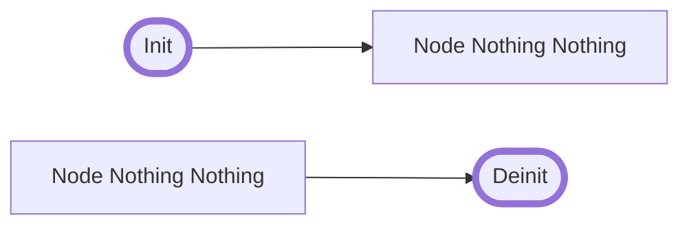
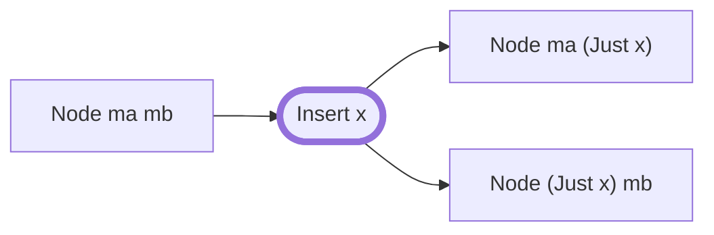
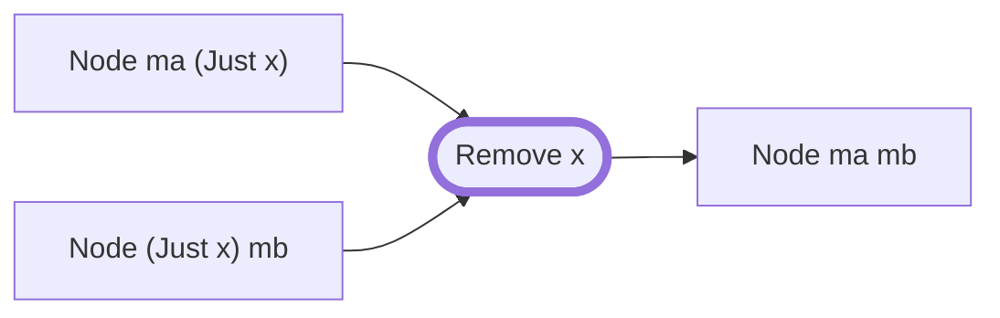
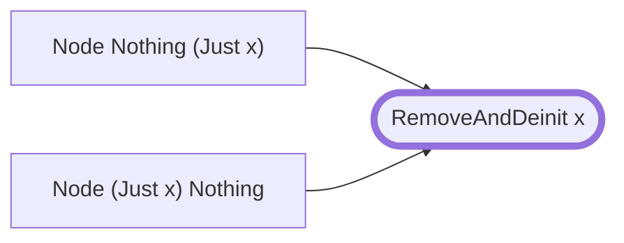
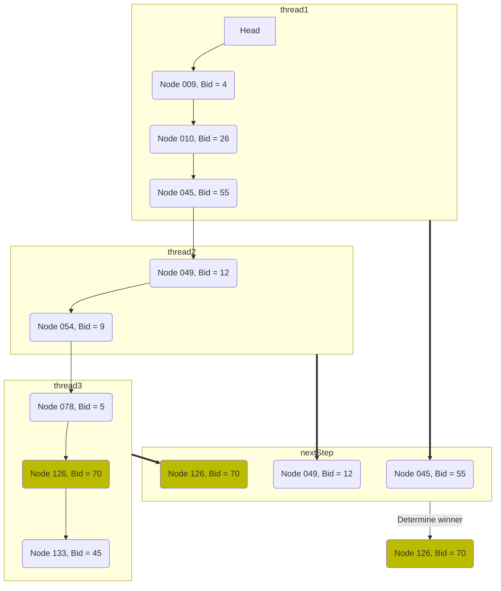
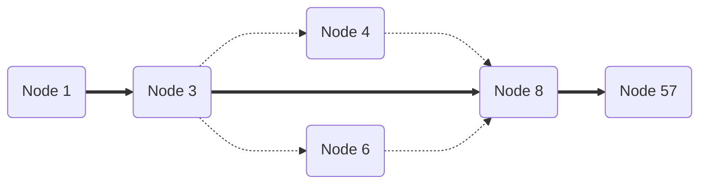
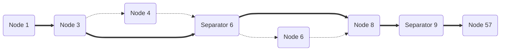

This document specifies an on-chain data structure to represent a finite set of keys. Specifically, we use a specialised version of the association list of linked nodes described in the [corresponding Plutonomicon article](https://github.com/Plutonomicon/plutonomicon/blob/main/assoc.md), using only keys instead of (key, value) pairs.

# Table of contents
- [Pure representation](#pure-representation)
  - [As linearly ordered set](#as-linearly-ordered-set)
  - [Covering node](#covering-node)
  - [Operations](#operations)
- [Technical details](#technical-details)
  - [TokenName](#tokenname)
- [FinSet Validator](#finset-validator)
- [In Grabbit Auctions](#in-grabbit-auctions)
- [Separators](#separators)
  - [Relation to Auction](#relation-to-auction)
- [Minting policies for node operations](#minting-policies-for-node-operations)

# Pure representation

A set of keys can be represented as a collection of nodes, where each node is a pair of an optional key and and optional next key:

```haskell
data SetNode k = Node
  { key  :: Maybe k
  , next :: Maybe k
  }
```

FinSet is implemented essentially as linked list (of `key`s) with restrictions over elements and order.

```mermaid
graph TB
    subgraph Head
        Key(key = Nothing)
        Next(next = 4)
    end
    Next --> Key4
    Next4 --> Key7
    Next7 --> Key37
    Next37 --> Key39
    subgraph Node 4
        Key4(key = 4)
        Next4(next = 7)
    end
    subgraph Node 7
        Key7(key = 7)
        Next7(next = 37)
    end
    subgraph Node 37
        Key37(key = 37)
        Next37(next = 39)
    end
    subgraph Node 39
        Key39(key = 39)
        Next39(next = Nothing)
    end

    classDef Tx stroke-width:2;
    classDef Node fill:#30309090
    classDef Value fill:#003300
```


*This is the FinSet* $\\{ 4; 7; 37; 39 \\}$

The `key` field represents the key of the node, while `next` points to the next node by referencing that node's key. The nodes in the collection must be unique on their `key` fields, and they must also be unique on their `next` fields.

At all times, there must be one node in the collection with `key` set to `Nothing` (the "head" node), and there must be one node in the collection with `next` set to `Nothing` (the "last" node). The same node can be both the head node and the last node, if the corresponding set is empty:

| key \ next | Nothing | Maybe k |
| --- | --- | --- |
| **Nothing** | Head/last node (empty set) | Head node |
| **Maybe k** | Last node | Non-head, non-last node |

The `next` field of a node, if it is not `Nothing`, must always reference the smallest key in the collection that is larger than the `key` of the node.

For example, the set `{1,3,9}` would be represented by four nodes:

```haskell
exampleNodes :: [SetNode ByteString]
exampleNodes =
  [ Node  Nothing (Just "1")
  , Node (Just "1") (Just "3")
  , Node (Just "3") (Just "9")
  , Node (Just "9")  Nothing
  ]
```

## As linearly ordered set

The FinSet is a *linear order* over `key`s.
Also, it's *linear order* over `next`s.

For `key`s as a *linear order*, `Nothing` is minimal value.

> $(∀ k_1 k_2 : \text{Keys})(k_1 < k_2 ⇔ \text{Nothing} ≺ \text{Just}\ k1 ≺ \text{Just}\ k2)$

For `next`s as a *linear order*, `Nothing` is the maximum value

> $(∀ k_1 k_2 : \text{Nexts})(k_1 < k_2 ⇔ \text{Just}\ k1 ≺ \text{Just}\ k2 ≺ \text{Nothing})$

Nodes themselves are ordered according to their keys:

> $(∀ x\ y\ z : \text{Node k})(x ≺ y ≺ z ⇔ x.key ≺ y.key ≺ z.key)$

## Covering node

For any key `x`, whether or not it is a member of the set, the *covering node* in the set is defined as the node that has a smaller `key` (if any) than `x` and a larger `next` (if any) than `x`:

> $covers(node,k) = (node.key ≺ k) ∧ (k ≺ node.next)$

It may be implement simply as
```haskell
covers :: Ord k => SetNode k -> k -> Bool
covers (Node ma mb) x =
  (ma == Nothing || ma < Just x) &&
  (mb == Nothing || Just x < mb)
```

Here is an example of covering nodes for a finite set of integers:

```mermaid
graph LR
    Node0_4("15 ≺ 129")
    Node0  -.-> Node0_4
    Node0_4 -.-> Node4
  
    Node0_4 --> |Covers key| Node2 
    Node0_4 --> |Covers key| Node3 

    subgraph "":
      Node0("_ ≺ 15"):::Node
      Node1("15 ≺ 23"):::Node
      Node2("23 ≺ 78"):::Node
      Node3("78 ≺ 129"):::Node
      Node4("129 ≺ _"):::Node

      Node0 ==> Node1 ==> Node2 ==> Node3 ==> Node4
    end

    Node1_4("23 ≺ 129")
    Node1  -.-> Node1_4
    Node1_4 -.-> Node4

    Node1_4 --> |Covers key| Node3 

    classDef Tx stroke-width:2;
    classDef Node fill:#30309090
    classDef Value fill:#003300

    style Node1_4 stroke:#999999,stroke-width:2px stroke-dasharray: 5 5
    style Node0_4 stroke:#999999,stroke-width:2px stroke-dasharray: 5 5
```



- `Node {key = Just 23, next = Just 129}` (`23 ≺ 129`) covers key `78`
  
  Which means that:
  - Node `78 ≺ 129` may be removed in favor of it
  - `78 ≺ 129` may be inserted between this node and `129 ≺ _`

- `Node {key = Just 15, next = Just 129}` (`15 ≺ 129`) covers keys: `23`,`78`

  Which means that:
  - In `{15,78,129}` node `78 ≺ 129` may be removed in favor of this node.
  - In `{15,129}` node `78 ≺ 129` may be inserted between this node and `129 ≺ _`
  - In `{15,23,129}` node `23 ≺ 129` may be removed in favor of this node.
  - In `{15,129}` node `23 ≺ 129` may be inserted between this node and `129 ≺ _`

## Operations

An empty set is initialised with a single head node: `Node Nothing Nothing`. To de-initialise an empty set, remove its head node.



To insert a key `x` into the set, replace its covering node `Node ma mb` with two consecutive nodes:



To remove a key `x` from the set, find the node `(Node (Just x) mb)` and its predecessor node `(Node ma (Just x))`, and then replace them with a single node that covers `x`:



Note that this mechanism doesn't allow the head node to be removed, because the head node doesn't correspond to a key. The only way to remove the head node is to first remove all other nodes, and then de-initialise the empty set, or use `RemoveAndDeinit` operation directly.

To remove a key `x` from the singleton set and instantly de-initialise it, find the node `(Node (Just x) Nothing)` and its predecessor node `(Node Nothing (Just x))`, and then remove them:



In Haskell code, the above operations correspond to the following:

```haskell
data SepNodeAction k
  = Init
  | Deinit 
  | InsertSeps
    { separatorsToRemove :: List k
    , coveringNode :: SetNode k
    }
  | RemoveSeps
    { separatorsToInsert :: List k
    , coveringNode :: SetNode k
    }
  | Insert
    { keyToInsert :: k
    , coveringNode :: SetNode k
    }
  | Remove
    { keyToRemove :: k
    , coveringNode :: SetNode k
    }
  | RemoveAndDeinit
    { theOnlyKey :: k
    }

data NodAction k
  = Init
  | Deinit 
  | Insert
    { keyToInsert :: k
    , coveringNode :: SetNode k
    }
  | Remove
    { keyToRemove :: k
    , coveringNode :: SetNode k
    }
  | RemoveAndDeinit
    { theOnlyKey :: k
    }

validNodeAction :: Ord k => SepNodeAction k -> Bool
validNodeAction Init   = True
validNodeAction Deinit = True
validNodeAction (InsertSeps xs n) = n `covers` xs
validNodeAction (RemoveSeps xs n) = n `covers` xs
validNodeAction (Insert x n) = n `covers` x
validNodeAction (Remove x n) = n `covers` x
validNodeAction (RemoveAndDeinit (Node (Just k) Nothing)) = True
validNodeAction _ = False

data NodeContext k = NodeContext
  { inputs  :: [SetNode k]
  , outputs :: [SetNode k]
  }

expectedNodeContext :: SepNodeAction k -> NodeContext k
expectedNodeContext Init
  = NodeContext
      []
      [Node Nothing Nothing]
expectedNodeContext Deinit
  = NodeContext
      [Node Nothing Nothing]
      []
expectedNodeContext (InsertSeps [a,b,c] (Node ma mb))
  = NodeContext
      [Node ma mb]
      [Node ma (Just a), Node (Just a) (Just b), Node (Just b) (Just c)
      , Node (Just c) mb] 
expectedNodeContext (RemoveSeps [x,y] (Node ma mb))
  = NodeContext
      [Node ma (Just x), Node (Just x) (Just y), Node (Just y) mb]
      [Node ma mb]
expectedNodeContext (Insert x (Node ma mb))
  = NodeContext
      [Node ma mb]
      [Node ma (Just x), Node (Just x) mb]
expectedNodeContext (Remove x (Node ma mb))
  = NodeContext
      [Node ma (Just x), Node (Just x) mb]
      [Node ma mb]
expectedNodeContext (RemoveAndDeinit k)
  = NodeContext
      [Node Nothing (Just k), Node (Just k) Nothing]
      []

```
# In Grabbit Auctions
In Grabbit Auctions, the FinSet is used to:
- order bidders
- make bidders unique
- ensure to take into account __every__ bid on winner lookup

Nodes themselves are not meant to carry bid information themselves, because due to the nature of auctions, bids will be happening often enough to make contention issues of insertion/removal operations.

This is why in the current design `FinSet` (as a bunch of UTxOs) **are separated** from auction. It allows bids to not interfere in any way with `FinSet` operations.

The `SetNode` `key` in current auction design is a bidder `PubKeyHash`.

Every `BidEscrow` has bidder `PubKeyHash` and every `SetNode` has so. This allows to easily identify whether certain `SetNode` is related to a certain `BidEscrow` or not. 

```mermaid
flowchart LR
    subgraph head
      direction TB
      Head([Head]):::Node -.-> AuctionEscrow
    end
    subgraph ae34bf
      direction TB
      Nodeae34bf([Node ae34bf]):::Node
      -.-> Bidae34bf["BidEscrow {bidder = ae34bf}"]
    end
    head --> ae34bf --> fa67eb
    subgraph fa67eb
      direction TB
      Nodefa67eb([Node fa67eb]):::Node
      -.-> Bidfa67eb["BidEscrow {bidder = fa67eb}"]
    end

    classDef Node fill:#30309090
    classDef MP fill:#330033
    classDef Value fill:#003300
    classDef Validator fill:#885500
    classDef Tx stroke-width:5;
    classDef PubKey fill:#444433
```


Auction resolution is done with a series of refunds followed by an auction deinitialization action at the end.

*The process of winner lookup done in parallel, simplified.*

This whole process is essentially a onchain linked list fold, it can be split on parts and done in parallel.
# Technical details
## TokenName

`TokenName` for FinSet token satisfies this grammar:

```bnf
<node token name>      ::= "FSN" <key> | ''
<seperator token name> ::= "FSN" <key> "Sep"
```

$$
\begin{align}
\text{where} &\\
& key ∈ Key
  \quad Key ⊂ \{ bs : ByteString\ \ |\ \ length\ bs ≤ 26 \}
  \quad (∀k ∈ Key)(k\ +\ "Sep"\ ∉ Keys)\\
\text{therefore} & \\
& node\ token\ name \cap seperator\ token\ name = \bot
\end{align}
$$

*I.e. a separator token name cannot collide with non-separator one.*

### Latin string can't be a key

An unconstrained latin string cannot be a key, even if it fits within the 26 bytes size, as it doesn't respect the restrictions over `key`.

Example:
`TokenName` with key `abSep` collides with separator one that has `ab` key:
```
<node token name> = FSN + abSep = FSNabSep
<seperator token name> = FSN + ab + Sep = FSNabSep
```

### PubKeyHash can be a key

As any constant-sized type, `PubKeyHash` is a good choice for `FinSet` node key as it's size restriction makes separator-node TN collision inpossible.

### Examples with constant-size key

For example, this is the `TokenName` of the `SetNode` with key `"e56f..a904"`:

`FSNe56f..a904`

Here is the `TokenName` of the Origin `SetNode`:

`FSN`

And here is the `TokenName` of the a Seperator `SetNode` with key`"aaaaaaaaa"`:

`FSNaaaaaaaaaaSep`

(By adding `Sep` to the end of the `TokenName` we ensure there will never be a collision with a constant-sized key)

For example, let `"2fc2...8806"` be the CS uniquely corresponding to some set that includes `{node 1, node 3, node 9}` as members. This set would be represented on-chain using the following utxos (ignoring the minimum 2 ADA per utxo requirement):`

```haskell
-- NB: `valAddr` here is the FinSet's validator address
exampleUtxos :: [Utxo Datum]
exampleUtxos =
  [ Utxo -- Origin
    { address = valAddr
    , value = "2fc2...8806" ↦ "FSN" ↦ 1
    , datum = toDatum $ Node Nothing (Just "1")
    }
  , Utxo -- Key 1
    { address = valAddr
    , value = "2fc2...8806" ↦ "FSN1" ↦ 1
    , datum = toDatum $ Node (Just "1") (Just "3")
    }
  , Utxo -- Key 3
    { address = valAddr
    , value = "2fc2...8806" ↦ "
    FSN3" ↦ 1
    , datum = toDatum $ Node (Just "3") (Just "5Sep")
    }
  , Utxo -- Separator 5
    { address = valAddr
    , value = "2fc2...8806" ↦ "
    FSN5Sep" ↦ 1
    , datum = toDatum $ (Just "5Sep")(Just "9")
    }
  , Utxo -- Key 9
    { address = valAddr
    , value = "2fc2...8806" ↦ "FSN9" ↦ 1
    , datum = toDatum $ Node (Just "9") Nothing
    }
  ]

```

As long as units of the `"2fc2...8806"` with valid `TokenName` only exist inside node utxos of the set and no other utxos (except the Corresponding Tokens), those node utxos can easily be selected in off-chain and on-chain contexts by filtering out utxos that do not contain this token.

# FinSet Validator

This validator holds all `SetNode` UTxOs. It must require every Tx containing a `SetNode` UTxO to be validated by `FinSetMP`.

Datum: `BultinData`

Redeemer: `BultinData`

```haskell
finSetValidator ::
  BultinByteString ->
  BuiltinData ->
  BuiltinData ->
  ScriptContext ->
  Bool
finSetValidator setNodeTnPrefix _ _ ctx@(scriptContextTxInfo 
 -> TxInfo {txInfoMinted}) =
  possiblyNodeCSs `isSubsetOf` Value.symbols txInfoMinted
  where
    possiblyNodeCS (cs,tn,_)
      | tokenNamePrefixedWith setNodeTnPrefix tn = Just cs
      | otherwise = Nothing

    possiblyNodeCSs :: [CurrencySymbol]
    possiblyNodeCSs =
      mapMaybe possiblyNodeCS $
        Value.flattenValue txOutValue
    Just TxOut {txOutValue} =
      Ctx.txInInfoResolved <$> findOwnInput ctx

```

# Separators

```haskell
data SeparatorsConfig = 
  MkSeparatorsConfig
   { address :: Address -- Address to send minAda to/Sign transactions
   , cutOff :: POSIXTime -- time after which seps cannot be added/can be removed
   }
```

Separators are an optimisation to reduce the contention of the nodes when enrolling into a auction. 


*An example of contention when inserting the node in a small FinSet. `Node 4` and `Node 6` cannot be inserted in parallel, because inserting `Node 4` changes `Node 3`, and Tx that inserts `Node 6` needs those changes.*

*An example of reducing contention by adding separators. The more nodes that already exist in a FinSet, the fewer contention issues there are. Separators are a cheap way to increase the amount of nodes prior to a large number of participants.* 

They are suffixed by `"Sep"` in order to ensure that they cannot be confused with an actual node key. This also ensures that there will never be a collision with an actual key if key has fixed size. 

Separators may only be added by the address determined and only before the `cutOff` time. They may be removed by anyone after `cutOff`, however the `minAda` must be refunded to the correct address.

## Relation to Auction

As Separator Tx (`InsertSeps`, `RemoveSeps`) are not validated by the AuctionValidator, the mint amounts must be explicit so as to ensure no authentic `SetNode` UTxOs linked to `BidEscrow` tokens are burnt/minted.

# Minting policies for node operations

The minting policy of the set token ensures that only legitimate operations can be performed on the nodes of the set. The redeemer for this minting policy is `SepNodeAction`, defined above.

For convenience, we define a specialised version of `ScriptContext` that only holds the information relevant to node operations:

```haskell
-- Given an asset class, find the inputs and outputs in the
-- ScriptContext that contain tokens of that asset class.
actualNodeContext :: IsNodeKey k => AssetClass -> ScriptContext -> NodeContext k

-- We need a (partial) mapping from general UTXO datums to a node key.
class IsNodeKey k where
  getKey :: Datum -> Maybe k
```

The minting policy for node operations checks that the correct number of tokens is minted, and that the actual `NodeContext` corresponds to the expected `NodeContext`. Additionally, the minting policy is parametrised by a UTxO reference for an input that must be consumed in the `Init` transaction of the set, and the asset class of the set is defined to be the currency symbol of this parametrised minting policy.

All minted/burned tokens must go to/from `nodeValidator`.

```haskell
nodeM ::
  forall (k :: Type).
  (Ord k, FromData k) =>
  TxOutRef ->
  ValidatorHash ->
  Seperators ->
  SepNodeAction k ->
  ScriptContext ->
  Bool
nodeM
  uRef
  nodeValidator
  seps 
  nodeAction
  ctx@(scriptContextTxInfo -> info@TxInfo {txInfoInputs, txInfoOutputs, txInfoMint}) =
    correctAction
      && correctMinted
      && actualMatchesExpected
      && correctInit
      -- Enforces all minted or burned value to go in/from node validator
      && outsAgainstValidatorAddress == assetClassValue ac m
      && mintsAuctionCSIfNonInitialOrSep
      && checkSeps
    where
      ownCS = ownCurrencySymbol ctx
      mintsAuctionCSIfNonInitialOrSep :: Bool
      mintsAuctionCSIfNonInitialOrSep
        | Init | InsertSeps | RemoveSep <- nodeAction = True
        | otherwise = stateCS /= 0 
        where stateCS = findStateCS ownCS inputs refInputs 
     
      ac n = AssetClass (ownCS, "FSN" <> n)
      corrAc = AssetClass (ownCS, "FCN")
      m n = txInfoMint `assetClassValueOf` (ac n)
      separator n = n <> "Sep" 
      addToken amount bs = (<>) (singleton ownCS (seperator bs) amount)
      correctAction = validNodeAction nodeAction
      correctMinted = case nodeAction of
        Init -> m "" == 1 && txInfoMint `assetClassValueOf` corrAc == 1
        Deinit -> m "" == (-1) && txInfoMint `assetClassValueOf` corrAc == -1
        InsertSeps keys _ -> txInfoMint == foldMap (addToken 1) keys
        RemoveSep keys _ -> txInfoMint == foldMap (addToken (-1)) keys
        Insert key _ -> m key == 1
        Remove key _ -> m key == (-1)
        RemoveAndDeinit key -> m "" == (-1) && m key == (-1)
            && txInfoMint `assetClassValueOf` corrAc == -1
      actualMatchesExpected =
        nodeContext info ac `equalContexts` expectedNodeContext nodeAction
      correctInit = not (nodeAction == Init) || spendsOutput info uRef
      checkSeps :: Bool 
      checkSeps 
        | InsertSeps <- nodeAction = 
             signedBy seps.address.pk && before seps.cutOff
        | RemoveSep <- nodeAction = 
              after seps.cutOff && isRefunded seps.address
        | otherwise = True
```
